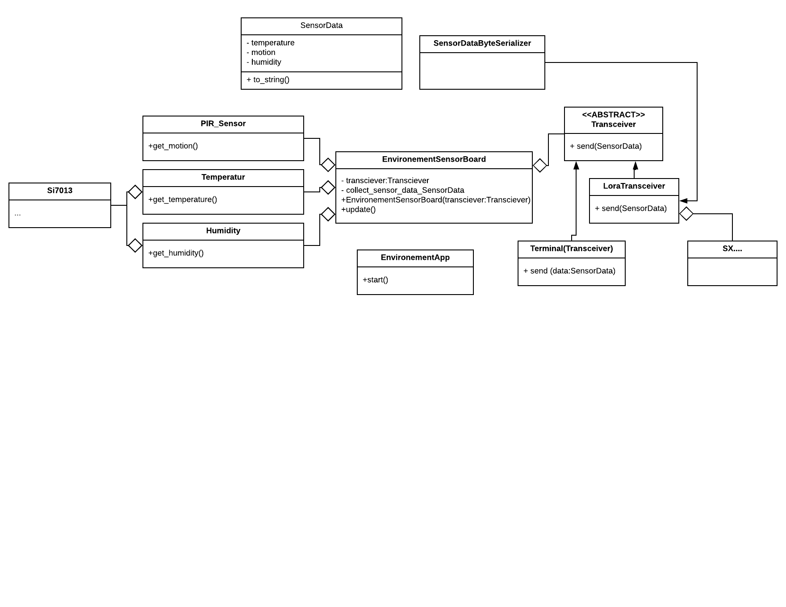

# Project Smart-Campus - Firmware

This is the firmware for a environment Sensor Board for the project Smart-Campus created by University College VIVES campus Bruges.

## Setting up the project

First you need to create `.mbed` file with the following content:

```
ROOT=.
TOOLCHAIN=GCC_ARM
TARGET=NUCLEO_L476RG
```

Next you need to enable C++11 compilation. This can be achieved by changing the three json configurations files in `code/mbed-os/tools/profiles`. Change the `cxx` section of the `GCC_ARM` config to the following:

```json
        "cxx": ["-std=gnu++11", "-fno-rtti", "-Wvla"],
```

## Enabling LoRaWAN

### The Things Network

Create an application on *The Things Network* and make sure to register each device. Also add the following payload formatter:

```javascript
function Decoder(bytes, port) {
        // Decode an uplink message from a byte buffer
        var temperature = (bytes[0] * 255) +  bytes[1];
        var humidity = bytes[2];
        var movement = (bytes[3] * 255) +  bytes[4];

        // Place each property inside the decoded object
        var decoded = {};
        decoded.temperature = temperature;
        decoded.humidity = humidity;
        decoded.movement = movement;

        return decoded;
}
```

### Add network credentials

Copy the file `mbed_app.example.json` as `mbed_app.json` in the root directory of your application. This file contains all the user specific configurations your application and the mBed OS LoRaWAN stack need. Network credentials are typically provided by LoRa network provider. Make sure never to commit this file as it stores confidential keys.

Open the `mbed_app.json` file in your favorite editor. First one needs to configure the pinout of the LoRa transceiver. Since the PCB is not an officially supported board, the default values at the top should be overridden with the following content:

```json
        "lora-radio": {
            "help": "Which radio to use (options: SX1272,SX1276)",
            "value": "SX1276"
        },

        "main_stack_size":      2048,
        "lora-radio":          "SX1276",
        "lora-spi-mosi":       "D11",
        "lora-spi-miso":       "D12",
        "lora-spi-sclk":       "D13",
        "lora-cs":             "D10",
        "lora-reset":          "A0",
        "lora-dio0":           "D2",
        "lora-dio1":           "D3",
        "lora-dio2":           "D4",
        "lora-dio3":           "D5",
        "lora-dio4":           "D8",
        "lora-dio5":           "D9",
        "lora-rf-switch-ctl1": "NC",
        "lora-rf-switch-ctl2": "NC",
        "lora-txctl":          "NC",
        "lora-rxctl":          "NC",
        "lora-ant-switch":     "NC",
        "lora-pwr-amp-ctl":    "NC",
        "lora-tcxo":           "NC"
    },
```

Next the keys need to be configured so the device can join the network. You can choose between OTAA and ABP.

#### For OTAA

Please add `Device EUI`, `Application EUI` and `Application Key` needed for Over-the-air-activation (OTAA). For example:

```json

"lora.device-eui": "{ YOUR_DEVICE_EUI }",
"lora.application-eui": "{ YOUR_APPLICATION_EUI }",
"lora.application-key": "{ YOUR_APPLICATION_KEY }"
```

#### For ABP

For Activation-By-Personalization (ABP) connection method, modify the `mbed_app.json` to enable ABP. You can do it by simply turning off OTAA. For example:

```json
"lora.over-the-air-activation": false,
```

In addition to that, you need to provide `Application Session Key`, `Network Session Key` and `Device Address`. For example:

```json
"lora.appskey": "{ YOUR_APPLICATION_SESSION_KEY }",
"lora.nwkskey": "{ YOUR_NETWORK_SESSION_KEY }",
"lora.device-address": " YOUR_DEVICE_ADDRESS_IN_HEX  " 
```

## Problem with Si7013

Apparently there is an addressing issue with the Si7013. The library configures the device at address `0x82` while it's real address is `0x80`. This needs to be fixed after issuing an mBed deploy command. Edit the file `SILABS_RHT/SILABS_RHT.cpp` as below:

```c++
/** I2C device address for Si7013 */
#define SI7013_ADDR      0x80
```

## Compiling the application

Use Mbed CLI commands to generate a binary for the application. This can be achieved by running the `mbed compile` command.

If you want to flash the project into your mbed board, just add `-f` after the command like so:

```shell
$ mbed compile -f
```

## Running the application

Drag and drop the application binary from `BUILD/YOUR_TARGET/ARM/mbed-os-example-lora.bin` to your Mbed enabled target hardware, which appears as a USB device on your host machine. 

Attach a serial console emulator of your choice (for example, PuTTY, Minicom or screen) to your USB device. Set the baudrate to 115200 bit/s, and reset your board by pressing the reset button.

You should see an output similar to this:

```
Mbed LoRaWANStack initialized 

 CONFIRMED message retries : 3 

 Adaptive data  rate (ADR) - Enabled 

 Connection - In Progress ...

 Connection - Successful 

 Dummy Sensor Value = 2.1 

 25 bytes scheduled for transmission 
 
 Message Sent to Network Server
```

## Data on the TTN

If all goes as plan you should see the data arrive at The Things Network as shown below.


---

## Development

### Adding libraries

If you add other libraries, please only add the `.lib` file to the repository and add the actual library directory to the `code/.gitignore` file. Take a look inside the file for an example.

### UML diagram

